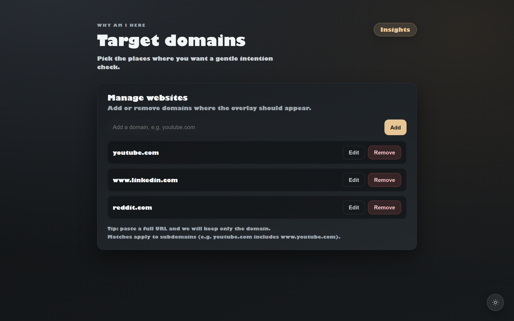
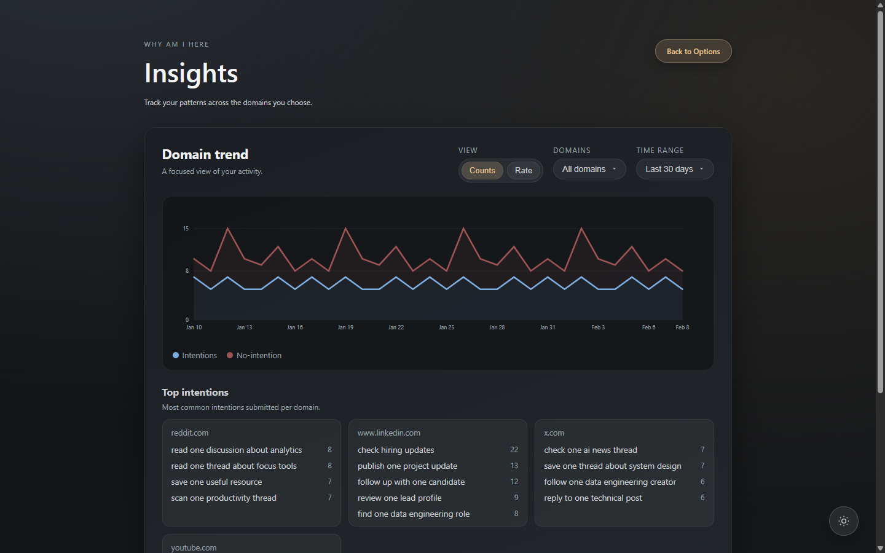

# why am i here

A browser extension that turns impulsive browsing into intentional sessions.

## What it does
When you open a domain in your target list, the page pauses and asks one question:
**"Why am I here?"**

You set an intention, add a timebox, and continue with a floating pill that keeps the session visible.
If you submit without selecting a timer, a quick math check appears and then starts a default 1-minute timer.

## How it works
1. Configure the domains you want to guard in Options.

2. On those domains, the overlay blocks background interaction until you submit a valid intention.
3. Start with a timer (`5m`, `10m`, `20m`, or custom) or complete the math gate for the default `1m`.
4. Browse with a visible intention pill and countdown.
5. When the timer expires, the overlay returns so you can recommit.
6. Use Insights to review no-intention rate, counts, and top intentions by domain and time range.

## Privacy
All data stays local in your browser.
No cloud sync, no ads, no external tracking.
